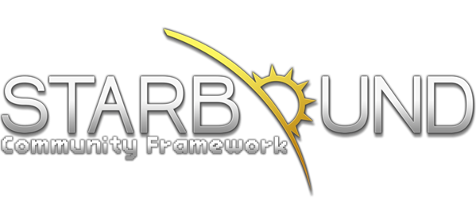

# About
Community Framework is a mod for Starbound which adds new scripts and functionality to Starbound which other modders may use and build off of. This mod adds nothing to the gameplay by itself.

However, the best part about Community Framework is that it's open. Virtually anyone can add new things to Community Framework or improve existing functionality!

And when other mods use Community Framework instead of attempting to implement their own functionality, it improves mod compatibility and makes everyone's life easier.
